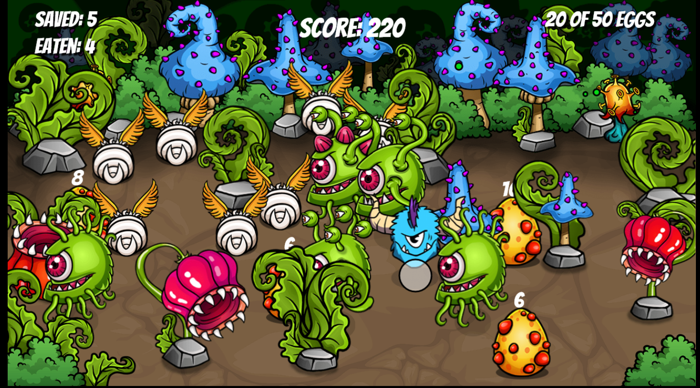
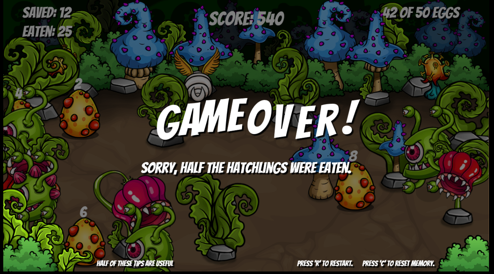

# Javascript-GAME-Bullseye

---

please, feel free to check the game out. link to the streaming game. @[Bullseye GAME](https://gideonilamim.github.io/Javascript-GAME-Bullseye/)

or the tutorial video on You Tube: @[JavaScript GameDev Tutorial – Code an Animated Physics Game [Full Course]](https://www.youtube.com/watch?v=U34l-Xz5ynU&list=LL&index=22)

---

Developing something is definitely a good way to learn coding. This game will help you to achieve just that. 
This project is the most fun project I've done so far. Developing a simple game is trully a lot of fun. 

You can also do as I did: I made some slight modifications to the game. I also added some animations at the end of the game. Enjoy!!

---
## THE GAME

it's a simple game. We have to prevent the hatchlings from being eaten as much as possible. To do so, we have to push the enemies around. If you lose 25 hatchlings, you lose the game. Winning is easy. The more hatchlings you save, the more score you'll get.  

